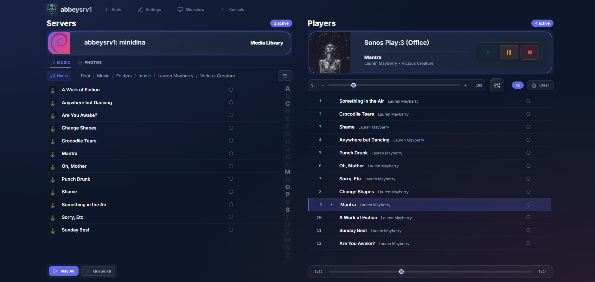
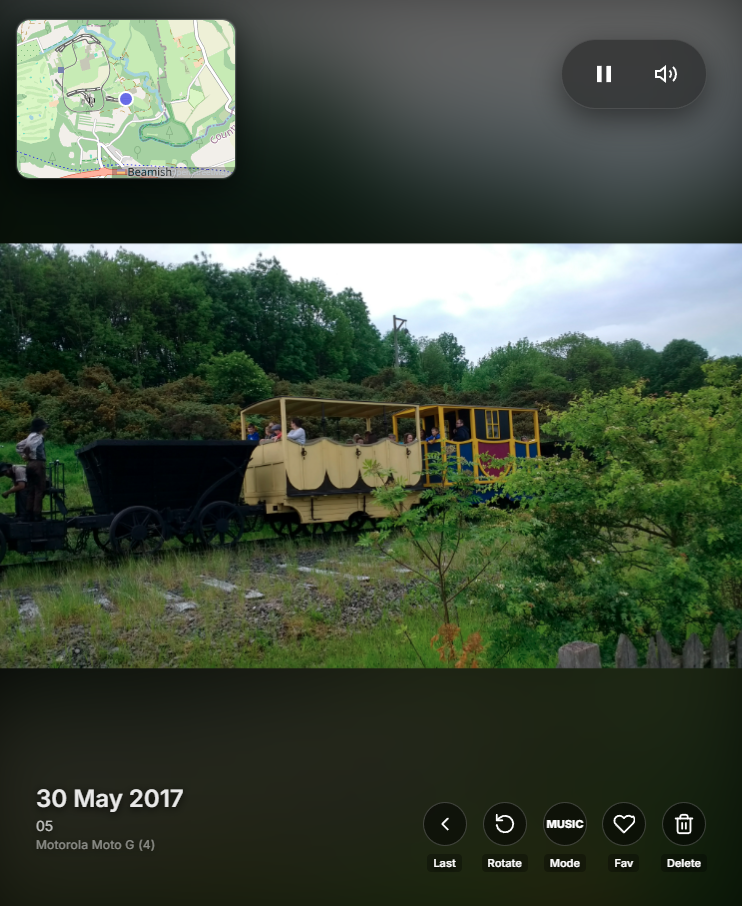
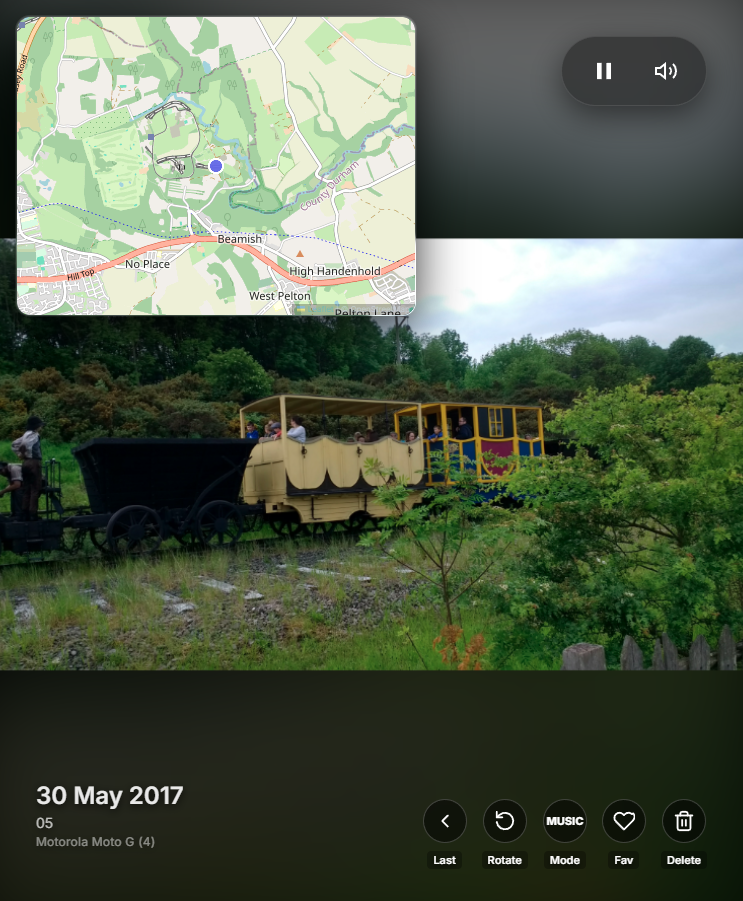
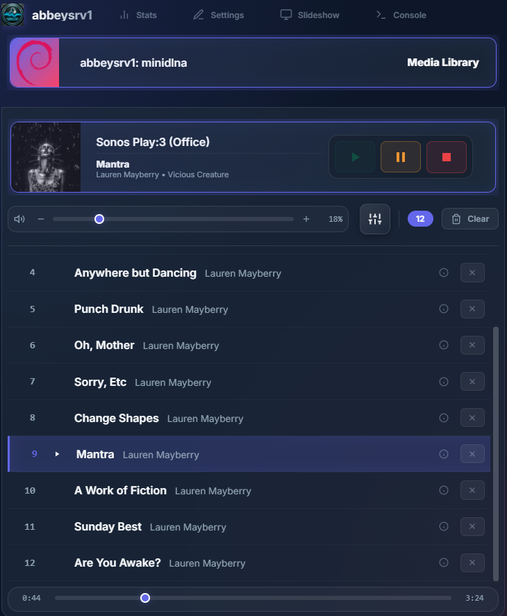

# UI for an Abbeytek Media Machine (AMMUI)

A web based media manager for a home network. Plays music and views family photos.

* Play music from local servers (Subsonic, MiniDLNA/ReadyDLNA, etc.)
* Send to local players (Sonos and DLNA players)
* Display a slideshow of photos from a local server. Modes are: All, On this day, Favorites, Music (currently playing album art)
* Set home folders for Music Browsing, Photo Browsing and Slideshow.
* Album art retrieved from discogs. (Api key required)
* Includes a local DLNA server where you can download music/photos to.



This UI forms part of a standalone product, the Abbeytek Media Machine, which is basically an embedded device with an Audio HAT and speakers and DLNA player software onboard. Adding this UI makes it an all in one server/player you can just drop on your network.

As we have a linux box on our network, we're running this on it, and we have a 10" tablet running the UI in Chrome. The same box is also running minidlna.

## Slideshow:
* Apply rotation to photos and the server will remember.
* Delete a photo to hide it from the slideshow in future.
* Go back to the last picture in the slideshow in case you just missed it.
* Quick pause and volume controls for current music player, if active.
* Photo date and device used info is shown if available.
* Photos with location data present will show a small map overlay. Click on map to show larger view. 




## Tablet mode
* Player / server expandable panes.



## Local DLNA Server
* Upload button to upload tracks and photos from local disk.
* Download buttons on music and photos from other servers to add a copy to the local server.
* Sync all local music and photo files to S3.

## 🚀 Getting Started

### Prerequisites
*   Node.js (v18 or higher)
*   npm

### Installation

1.  Clone the repository:
    ```bash
    git clone https://github.com/abbeytekmd/ammui.git
    cd ammui
    ```

2.  Install dependencies:
    ```bash
    npm install
    ```

### Usage

1.  Start the application:
    ```bash
    npm start
    ```

2.  Open your browser and navigate to:
    ```
    http://localhost:3000
    ```

## ⚙️ Built With

*   **Node.js & Express** - Backend server
*   **node-ssdp** - UPnP/DLNA discovery
*   **sonos** - Sonos device support
*   **Vanilla JS & CSS3** - Frontend interface

## Tested with

* Sonos Play 5 Rev 1
* Sonos Play 3 Rev 1
* Linux upmpdcli
* ReadyDLNA/MiniDLNA
* Subsonic
* JRiver Media Center (Windows)
* Windows Media Player

## 📄 License

This project is licensed under the MIT License.
