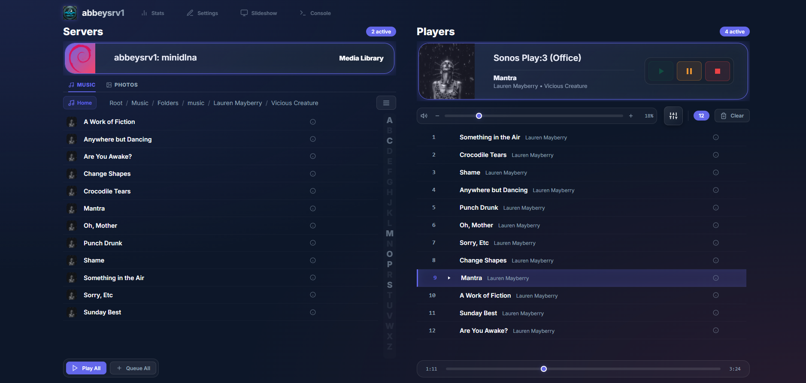
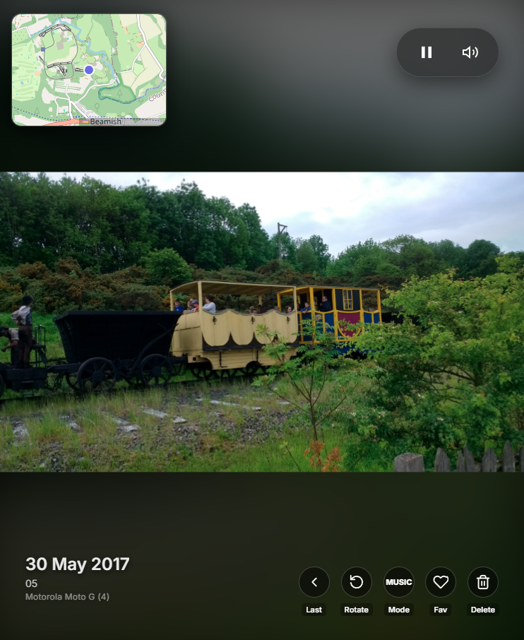
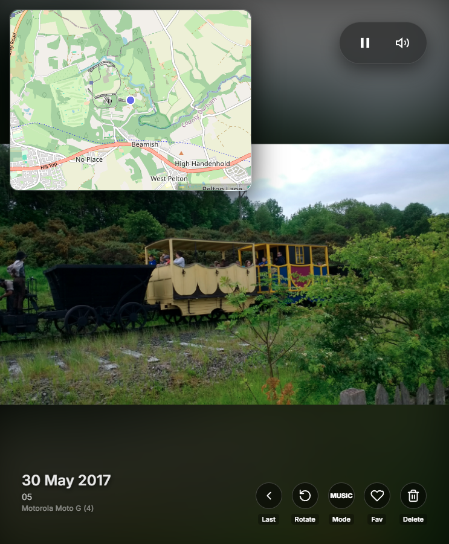
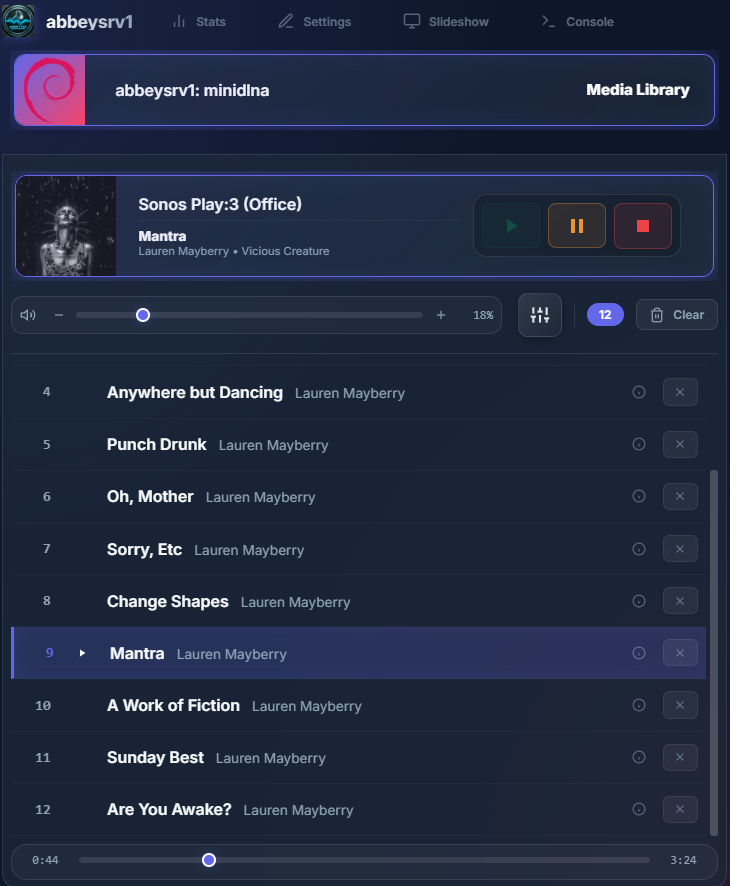

# UI for an Abbeytek Media Machine (AMMUI)

A web based home hub with DLNA server, player and controller. Plays music and shows family photos, great if you have a large mp3 and/or photo collection.
* Left side of the screen - media server: Built in one or an external one: Subsonic, MiniDLNA, etc.
* Right side of the screen - playback device: DLNA player, Sonos, Airplay



## Features

* Send music to local players (Sonos and DLNA players. Some Airplay support - ffmepg must be installed on the host machine)
* Play music from local servers (Subsonic, MiniDLNA/ReadyDLNA, etc.)
* Display a slideshow of photos. Modes are: All, On this day, Favorites, Recent (photos from this month and last month), Music (album art of playing track)
* Browse the media library as Music, Photos or Videos, each with its own home folder.
* Set home folders for Music Browsing, Photo Browsing, Video Browsing and Slideshow.
* Album art can be retrieved from discogs.
* Watch a track's music video on YouTube, right from the track list (needs a YouTube API key - see [Music Videos](#music-videos)).

## Local Media Server

* Build local media library - Download/Tag/Organise music/photos. Served over DLNA.
* Identify an untagged music track from its audio via AcoustID and fill in Title/Artist/Album/Year (needs an AcoustID API key in Settings and the `fpcalc`/Chromaprint tool installed).
* View server and browser logs from the menu (Logs), filtered by type (YOUTUBE, DEBUG, DEVICES, UPLOAD, and so on) to help track down problems.

I have this running on a headless linux box and I run the UI from a Samsung tablet, my work PC, a Raspberry PI 5 connected to a 15" display and as a centrepiece to the house, I bought an old DELL All-In-One (Optiplex 3011) off ebay for 60 quid with Win10/Chrome.

## Slideshow:
* Apply rotation to photos and the server will remember.
* Delete a photo to hide it from the slideshow in future.
* Go back to the last picture in the slideshow in case you just missed it.
* Overlay pause and volume controls for current music player, if active.
* Photo date and device used info is shown if available.
* Photos with location data present will show a small map overlay. Click on map to show larger view. 




## Tablet/Phone mode
* Player / server switchable panes.



## Local DLNA Server
* Upload button to upload tracks and photos from local disk.
* Download buttons on music and photos from other servers to add a copy to the local server.
* Sync all local music and photo files to S3 compatible storage (I use Wasabi).

## Music Videos
Watch a track's music video on YouTube, right from the track list. When the video ends, the player closes by itself.

> **A YouTube API key is required.** Without one nothing can be looked up, so tracks that haven't already been matched show no Video button. Create a free key in the Google Cloud console (enable the "YouTube Data API v3"), then paste it in **Settings → Integrations**. See [How music video matching works](#how-music-video-matching-works) for the details and quota limits.

### The Video button
* Solid: a video is known. Dashed ("Video?"): not searched yet (click to search now). Struck through ("No video"): searched and nothing was found (click to choose one).
* A gold star on the button shows how likely the video is to be the real thing:
  * **Full star** - found on the artist's own channel and it isn't a lyric, audio, visualiser, live, cover or remix upload.
  * **Half star** - a video from another channel that is titled "Official Video", or one you picked by hand from the search results.
  * **No star** - anything else, such as a lyric video or a live cut. It still plays.
* If a video is missing or wrong, open the track's File Information and choose "Find video on YouTube" to pick from the search results.
* The optional `yt-dlp` tool and ffmpeg let videos with embedding disabled play locally (see Getting Started).

## Managing your music library

Your local library lives in the `local/music` folder on the server, organised as `Artist/Album/Track`. Everything is served over DLNA, so folder names and file tags both matter: players show the tags, while the folders decide where a track sits. Most of the tools below exist to keep those two in agreement.

Browse the local server in **Music** mode to see the commands. Most of them are on the local server only.

### Getting music in

* **Upload** (toolbar): add a single file. **Upload Folder**: add a whole folder of music, photos or videos. Music is filed into `Artist/Album/Title` using the file's tags, falling back to `Unknown Artist` / `Unknown Album` when tags are missing. Supported: mp3, flac, m4a, aac, wav, ogg and opus.
* **Download** (row menu, on a track or folder from another media server): copies it into the local library. Folders download in the background with a progress window, and files that already exist are skipped.
* **Import a folder by hand**: copy music straight into `local/music` and use **Reimport** (below) to tidy it up.

### Folder menu (the ☰ button on each row)

| Command | What it does |
|---|---|
| **Build Album** | Gathers scattered tracks that share an album title (for example a compilation split across artist folders), lets you tick which ones to include and choose the artist folder (`Various Artists` or one of the existing artists, or your own name), then moves them into one album folder. |
| **Rename** | Renames the folder. If a folder with that name already exists you're asked whether to merge into it. |
| **Merge Into** | Moves everything in this folder into another folder alongside it (pick from the suggestions or type a new name), for example to combine `The Beatles` and `Beatles`. |
| **Reimport (Move to Tag Locations)** | Moves every track in the folder to `Artist/Album` folders that match its own tags, as a fresh import would. Exact duplicates are removed, and a different file already at the destination is left alone and reported as a failure. Empty folders left behind are cleaned up. |
| **Identify Tags from Filename** | For files with missing or generic tags (blank, "Unknown", "Track"), guesses artist and title from the file name and confirms the guess against Discogs before writing the tags. Files that already have tags are untouched. Needs a Discogs token in Settings. |
| **Sync File Tags** | Writes the folder names into the files: the album folder becomes the Album tag and the artist folder becomes the Artist tag, for every audio file inside. Use it after you've renamed or merged folders. This is the opposite direction to Reimport. |
| **Delete** | Permanently deletes the file or folder from the library. There is no recycle bin for music. |
| **Download** | Only appears for other servers' content (see above). |

On a single track the menu also offers **Sync File Tags**, **Delete**, and, when the file's folder doesn't match its tags, **Move to Tag Location** (moves just that file, as Reimport does for a folder).

### File information panel (the ⓘ button on a track)

The ⓘ button turns red and pulses when a track's `Artist/Album` folders disagree with its tags, which is the cue to fix one or the other. The panel shows the file's metadata and, for local files, lets you edit it:

* **Title, Artist, Album Artist, Album, Year**: edit a field and press **Save** to write it into the file.
* **All** (next to Artist, Album Artist and Album): copies that value to every track in the same folder.
* **Identify with AcoustID**: fingerprints the audio and looks it up on AcoustID. On a confident match it fills in Title/Artist/Album/Year, highlighted for you to review before saving. Nothing is written until you press Save. Needs an AcoustID key in Settings and `fpcalc` installed.
* **Tags / favourite**: label a track with your own tags, which can then be played from the Play Tag button. Favourite is a reserved tag.

### A typical clean-up

1. **Upload** or copy the new music in.
2. On folders with untagged tracks, run **Identify Tags from Filename**, or open a track's ⓘ and **Identify with AcoustID**.
3. Run **Reimport** on the folder so tracks land in the right `Artist/Album` folders.
4. Use **Build Album** for compilations, and **Rename** / **Merge Into** to tidy near-duplicate artist folders.
5. Run **Sync File Tags** on anything you renamed or merged so the files match their folders.
6. Check the red ⓘ buttons for anything that still disagrees, and fix the album art.
7. **Export Tags** and **Sync Now** to keep a backup.


### Album art

Art is looked up in this order: a `folder.jpg`, `cover.jpg`, `folder.png`, `cover.png`, `album.jpg` or `artwork.jpg` in the same folder, then a picture embedded in the file, then an automatic Discogs search by artist and album (needs a Discogs token in Settings). If a track still has no art, or the wrong one, use the **Retry album art** button on the slideshow's music bar to search Discogs by artist and album yourself and pick a replacement.

### Menu and settings commands

* **Set Home** (top of the browser, ☰): remember this folder as the starting point for Music browsing. It also sets where **Build Album** puts new albums.
* **Logs** (logo menu): see what a command did and why it failed, filtered by type (for example `IDENTIFY`, `TAGS`, `UPLOAD`).
* **Stats** (logo menu): playback statistics for your library.
* **Server Settings → General → Local Library**: file counts and sizes for what is stored on the server.
* **Server Settings → General → Tags**: **Export Tags** saves all your file tags (favourites included) to a file. **Import Tags** loads one, matching files by path and falling back to file name if they've since moved. Use this to back up your tagging or copy it to another AMMUI.
* **Server Settings → Integrations**: the Discogs token (album art and filename identification), AcoustID key (audio fingerprinting), YouTube key, and **S3 Cloud Sync**.
* **S3 Cloud Sync → Sync Now / View Log**: copies the local music and photos to an S3 bucket as a backup. View Log shows the result of the last sync.

### Logs

Open the logo menu and choose **Logs** to see the discovered devices (IP address table) and a live log of the server and browser. Use the type dropdown above the log window to show a single log type, such as `YOUTUBE`, `IDENTIFY`, `DEVICES` or `DEBUG` (DEBUG is hidden from the default "All types" view because it is noisy). Log lines are given a type from their `[TAG]` prefix; untagged messages are grouped by keyword. The server keeps the last 1000 lines and the browser the last 500.

## How music video matching works

This describes what happens behind the Video button (see [Music Videos](#music-videos) for what the button shows).

**Requires a YouTube API key** in Settings → Integrations. All lookups use the YouTube Data API. Without a key no searching happens, so tracks that haven't already been matched show no Video button.

### How a video is found
1. The local database is checked first. Matches are remembered, so a folder you have opened before costs nothing.
2. Otherwise the artist's YouTube channel is located once (a channel called "... - Topic" is skipped, as it only holds audio). Its uploads are read 50 at a time, just until the track turns up, and every page is stored so other albums by the artist match without more API calls.
3. If the only match on that channel is a live, audio or lyric cut, the rest of the channel is read to look for a better one.
4. If the artist's channel has no proper video, YouTube is searched for the track and a result is used only if its title says "Official Video" (or "Official Music Video"), it is the right song and it isn't a lyric, audio or live cut. That is marked with a half star. If nothing qualifies, the live/audio/lyric match from step 3 is used unstarred, or the track is marked "No video".

### Fixing a wrong or missing video
* Open the track's File Information and choose "Find video on YouTube" to pick from the search results. Your choice is saved and gets a half star.
* In the Database Stats dialog (menu), the YouTube section has a **Re-match non-official videos** button. It forgets every matched video that has no star, so they are looked up again the next time you browse (stored channel uploads are reused, but a track that needs the "Official Video" search uses quota as described below). Starred videos, including ones you picked by hand, are kept.

### Quota and limits
* A channel search or a whole-of-YouTube search costs 100 of YouTube's 10,000 daily quota units; reading a page of uploads costs only a unit or two. Channel searches are capped at 60 a day and the "Official Video" searches at 30 a day, so a large library may take a few days to fill in. Tracks that hit a cap stay dashed and are retried later.
* If YouTube reports its quota is used up, automatic lookups pause for an hour.

## 🚀 Getting Started

### Prerequisites
*   Node.js (v18 or higher)
*   npm

### Installation

1.  Clone the repository:
    ```bash
    git clone https://github.com/abbeytekmd/ammui.git
    cd ammui
    ```

2.  Install dependencies:
    ```bash
    npm install
    ```

3. Optional: Install ffmpeg for Airplay support, photo/video thumbnails and local playback of YouTube videos.
    ```bash
    sudo apt-get install ffmpeg
    ```
    or just download/install the package on Windows.

4. Optional: Install Chromaprint (`fpcalc`) for "Identify with AcoustID".
    ```bash
    sudo apt-get install libchromaprint-tools
    ```
    or on Windows download the Chromaprint build and put `fpcalc.exe` on your PATH. Then add a free AcoustID API key under Settings → Integrations.

5. Optional: Install [yt-dlp](https://github.com/yt-dlp/yt-dlp) so YouTube videos that have embedding disabled can still play locally (in the "Video" button on a track) instead of opening on youtube.com.
    ```bash
    sudo apt-get install yt-dlp
    ```
    or on Windows download `yt-dlp.exe` and put it on your PATH. ffmpeg (step 3) is also required for this: the video is copied and the audio re-encoded to AAC on the fly, as YouTube's Opus audio could drop out partway through playback.

### Usage

1.  Start the application:
    ```bash
    npm start
    ```

2.  Open your browser and navigate to:
    ```
    http://localhost:3000
    ```

## ⚙️ Built With

*   **Node.js & Express** - Backend server
*   **node-ssdp** - UPnP/DLNA discovery
*   **sonos** - Sonos device support
*   **Vanilla JS & CSS3** - Frontend interface

## Tested with

### Sonos:
* Sonos Play 5 Gen 1
* Sonos Play 3 Gen 1
* Sonos Beam Gen 1

### Airplay:
* Logitech UE Wireless Air Speaker S-00118

### DLNA Clients:
* Linux upmpdcli

### DLNA Servers:
* ReadyDLNA/MiniDLNA
* Subsonic
* JRiver Media Center (Windows)
* Windows Media Player

## 📄 License

This project is licensed under the MIT License.
